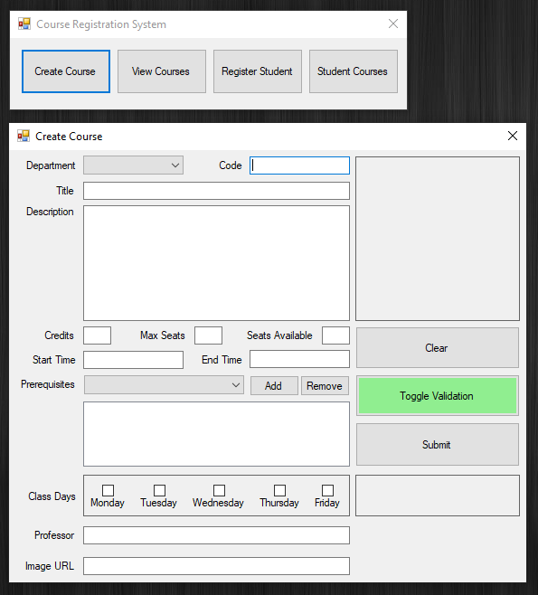
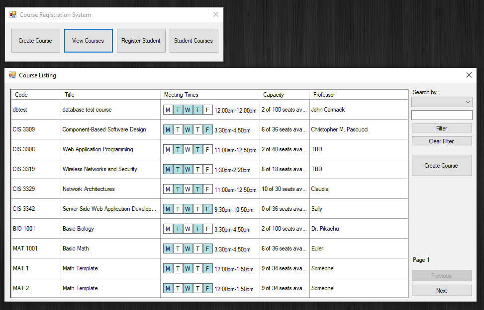
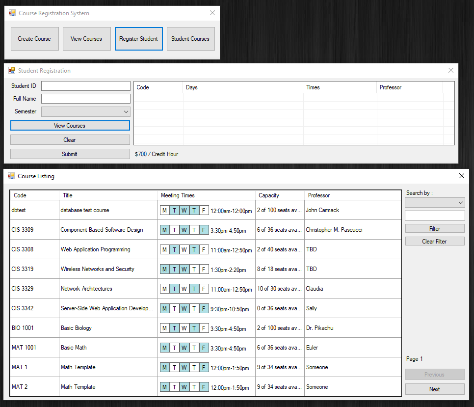
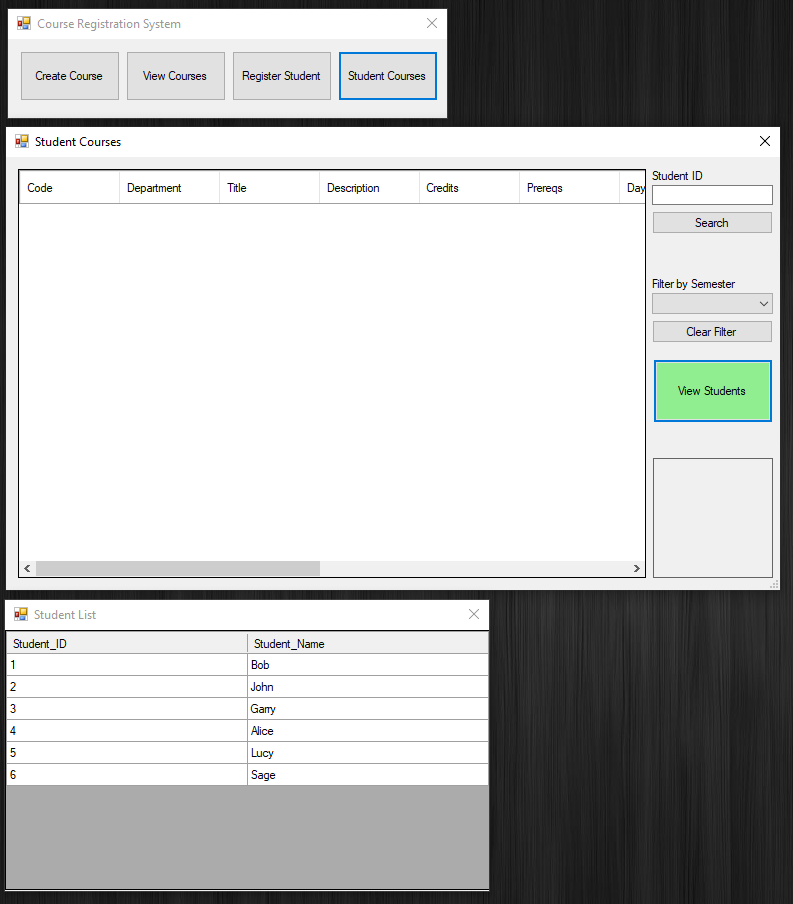
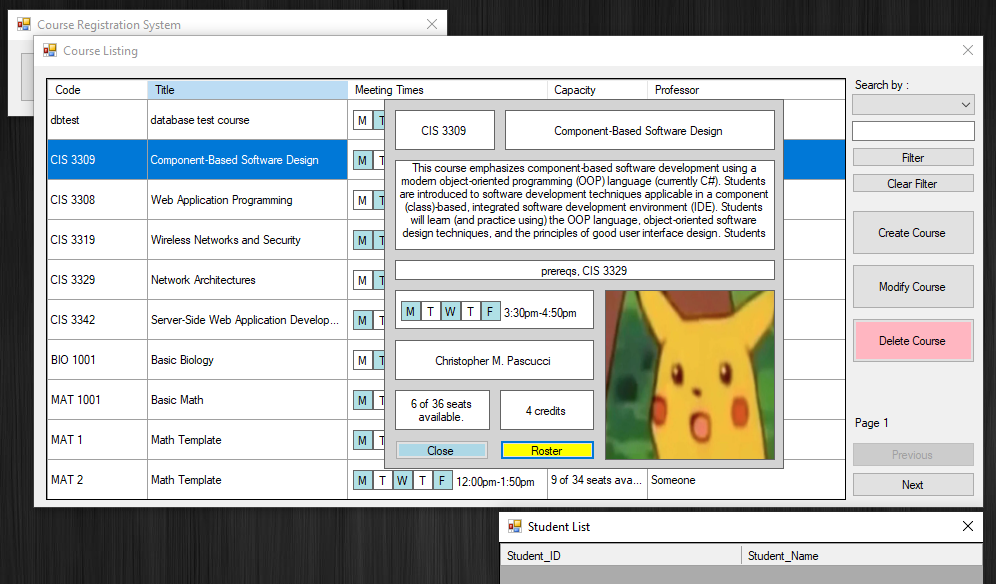

# Course Registration System

This project was made for a Component-Based Software Design course at Temple University.  
Users can Add/Modify/Delete courses in the system and create schedules for a student through registration. 

## Tools
- C#
- Visual Studio
- .NET
- ADO.NET
- MS Access

## Screenshots
  
  

